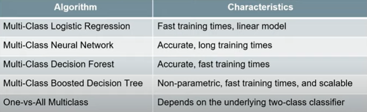

# Microsoft-Azure-ML-Scholarship

## Content
 Lesson 2 - [Introduction to ML](#introduction-to-machine-learning)
 
 Lesson 3 - [Model Training](#model-training)
 
 Lesson 4 - [Supervised & Unsupervised Learning](#supervised-and-unsupervised-learning)
 
 EXTRA 1 - [Resources, Notes, Videos](https://github.com/ananyaynkit/Microsoft-Udacity-ML-scholarship)
 
 EXTRA 2 - [How to Structure ML Projects](https://github.com/Divan009/Structuring-ML-Projects)

# Introduction to Machine Learning

_Basically convert everything into numbers_
## Scaling Data
Let's consider an example. Imagine you have an image represented as a set of RGB values ranging from 0 to 255. We can scale the range of the values from 0–255 down to a range of 0–1. This scaling process will not affect the algorithm output since every value is scaled in the same way. But it can speed up the training process, because now the algorithm only needs to handle numbers less than or equal to 1.
There are 2 approaches to it: **standardization** and **normalization**.

**Standardization _rescales data so that it has a mean of 0 and a standard deviation of 1_** 
(𝑥 − 𝜇)/𝜎   We subtract the mean (𝜇) from each value (x) and then divide by the standard deviation (𝜎)

**Normalization _rescales the data into the range [0, 1]._**
(𝑥 −𝑥𝑚𝑖𝑛)/(𝑥𝑚𝑎𝑥 −𝑥𝑚𝑖𝑛)    For each individual value, you subtract the minimum value (𝑥𝑚𝑖𝑛) for that input in the training dataset, and then divide by the range of the values in the training dataset. The range of the values is the difference between the maximum value (𝑥𝑚𝑎𝑥) and the minimum value (𝑥𝑚𝑖𝑛).

#### Whether to use Normalization or Standardization?

- **Normalization** is good to use when you know that the distribution of your data does not follow a Gaussian distribution(normal distribuition). This can be useful in algorithms that do not assume any distribution of the data like K-Nearest Neighbors and Neural Networks.
- **Standardization**, on the other hand, can be helpful in cases where the data follows a Gaussian distribution. However, this does not have to be necessarily true. 
Also, unlike normalization, standardization does not have a bounding range. So, if you have outliers in your data, they will not be affected by standardization.

## Encoding Categorical Data
When we have categorical data, we need to encode it in some way so that it is represented numerically.

#### Ordinal Encoding
In ordinal encoding, we simply convert the categorical data into integer codes ranging from 0 to (number of categories – 1).

**drawbacks** 
This approach is that it implicitly assumes an order across the categories. In the above example, Blue (which is encoded with a value of 2) seems to be more than Red (which is encoded with a value of 1), even though this is in fact not a meaningful way of comparing those values. This is not necessarily a problem, but it is a reason to be cautious in terms of how the encoded data is used.

#### One-Hot Encoding
we transform each categorical value into a column. If there are n categorical values, n new columns are added. 

##  Image Data
If you zoom in on an image far enough, you can see that it consists of small tiles, called pixels.

- In **grayscale images**, each pixel can be represented by a single number, which typically ranges from 0 to 255. This value determines how dark the pixel appears (e.g., 0 is black, while 255 is bright white).

- In **colored images**, each pixel can be represented by a vector of three numbers (each ranging from 0 to 255) for the three primary color channels: red, green, and blue(RGB).

The _number of channels_ required to represent the color is known as the **color depth** or simply depth. With an RGB image, depth = 3, because there are three channels (Red, Green, and Blue). In contrast, a grayscale image has depth = 1, because there is only one channel.

#### Encoding an Image
We need to know the following three things about an image to reproduce it:

- Horizontal position of each pixel
- Vertical position of each pixel
- Color of each pixel

The size of the vector required for any given image would be the **height * width * depth** of that image.

#### Assumptions
We would want to ensure that the input images have a _uniform aspect ratio_ (e.g., by making sure all of the input images are square in shape) and are _normalized_ (e.g. subtract mean pixel value in a channel from each pixel value in that channel)

## Text Data

#### Normalization
One of the challenges that can come up in text analysis is that there are often multiple forms that mean the same thing. 
For example, the verb _to be_ may show up as _is, am, are_, and so on. Or a document may contain alternative spellings of a word, such as _behavior vs. behaviour_. So one step that you will sometimes conduct in processing text is normalization.

Text **normalization** is the _process of transforming a piece of text into a canonical (official) form._

**Lemmatization** is an example of normalization. A lemma is the dictionary form of a word and lemmatization is the process of reducing multiple inflections to that single dictionary form. For example, we can apply this to the is, am, are example we mentioned above:
| Original Word      | Lemmatized word |
| ----------- | ----------- |
| is     | be       |
| are   | be      |
| a |  be |

**Stop words** are high-frequency words that are unnecessary (or unwanted) during the analysis. So, remove them.

Here we have **tokenized** the text (i.e., split each string of text into a list of smaller parts or tokens), _removed_ stop words (the), and _standardized spelling_ (changing lazzy to lazy).

#### Vectorization

After we have normalized the text, we can identify the particular features of the text that will be relevant to us for the particular task we want to perform—and then get those features extracted in a numerical form

- The approach of **TF-IDF** is to give less importance to words that contain less information and are common in documents, such as "the" and "this"—and to give higher importance to words that contain relevant information and appear less frequently. 

Read more
[Term Frequency-Inverse Document Frequency (TF-IDF) vectorization](https://en.wikipedia.org/wiki/Tf%E2%80%93idf)
Word embedding, as done with [Word2vec](https://en.wikipedia.org/wiki/Word2vec) or [Global Vectors (GloVe)](https://nlp.stanford.edu/pubs/glove.pdf)

#### Pipeline for Text Data
- In summary, a typical pipeline for text data begins by pre-processing or normalizing the text. This step typically includes tasks such as breaking the text into sentence and word tokens, standardizing the spelling of words, and removing overly common words (called stop words).
- The next step is feature extraction and vectorization, which creates a numeric representation of the documents. Common approaches include TF-IDF vectorization, Word2vec, and Global Vectors (GloVe).
- Last, we will feed the vectorized document and labels into a model and start the training.

## Computer science vs. Statistical perspective
A computer scientist might say something like:
_We are using input features to create a program that can generate the desired output._
For the **rows** in the table, we might call each row an entity or an observation about an entity. In our example above, each entity is simply a product, and when we speak of an observation, we are simply referring to the data collected about a given product. You'll also sometimes see a row of data referred to as an instance, in the sense that a row may be considered a single example (or instance) of data.

For the **columns** in the table, we might refer to each column as a feature or attribute which describes the property of an entity. In the above example, color and quantity are features (or attributes) of the products.

In contrast, someone with a background in statistics might be inclined to say something more like:
_We are trying to find a mathematical function that, given the values of the independent variables can predict the values of the dependent variables_.

## Models vs. Algorithms

**Models** are the _**specific representations** learned from data_

**Algorithms** are the _processes of learning_

We can think of the algorithm as a function—we give the algorithm data and it produces a model:

_Model=Algorithm(Data)_

We can think of an algorithm as a _mathematical tool_ that can usually be represented by an _equation_ as well as implemented in code. For example, y = Wx + b is an algorithm that can be used to calculate y from x if the values for W and b are known. But how do we get W and b?
This is the learning part of machine learning; That is, we can learn these values from training data.

## Linear Regression

**y = mx + b**

In algebraic terms, we may refer to **m** as the coefficient of x or simply the _slope of the line_, and we may call **b** the _y-intercept_. In machine learning, you will typically see the _y-intercept_ referred to as the **bias**. 

##### The Cost Function
Notice from our example of test scores earlier that the line we came up with did not perfectly fit the data. In fact, most of the data points were not on the line!
When we predict that a student who studies for 10 hours will get a score of 153, we do not expect their score to be exactly 153. Put another way, when we make a prediction using the line, we expect the prediction to have some error.

The **process of finding the best model is essentially a process of finding the coefficients and bias that minimize this error**. To calculate this error, we use a cost function. There are many cost functions you can choose from to train a model and the resulting error will be different depending one which cost function you choose. The most commonly used cost function for linear regression is the root mean squared error (RMSE)

We choose a cost function (like RMSE) to calculate the error and then _minimize that error_ in order to arrive at a line of best fit that models the training data and can be used to make predictions.

#### How to Prepare Data
- **Linear assumption**: linear regression describes variables using a line. So the relationship between the input variables and the output variable needs to be a linear relationship. If the raw data does not follow a linear relationship, you may be able to transform your data prior to using it with the linear regression algorithm. For example, if your data has an exponential relationship, you can use _log transformation_.
- **Remove collinearity**: When two variables are collinear, this means they can be modeled by the same line or are at least highly correlated; in other words, one input variable can be accurately predicted by the other. For example, suppose we want to predict education level using the input variables number of years studying at school, if an individual is male, and if an individual is female. In this case, we will see collinearity—the input variable if an individual is female can be perfectly predicted by if an individual is male, thus, we can say they are highly correlated. Having highly correlated input variables will make the model less consistent, so it's important to perform a correlation check among input variables and remove highly correlated input variables.
- **Gaussian (normal) distribution**: Linear regression assumes that the distance between output variables and real data (called residual) is normally distributed. If this is not the case in the raw data, you will need to first _transform the data_ so that the residual has a normal distribution.
- **Rescale data**: Linear regression is very sensitive to the distance among data points, so it's always a good idea to _normalize or standardize the data_.
- **Remove noise**: Linear regression is very sensitive to noise and outliers in the data. Outliers will significantly change the line learned. Thus, cleaning the data is a critical step prior to applying linear regression.

The training process is a process of minimizing the error

## Parametric vs. Non-parametric

**Parametric machine** learning algorithms _make assumptions about the mapping function_ and _have a fixed number of parameters_. No matter how much data is used to learn the model, this will not change how many parameters the algorithm has.
**Benefits:**
Simpler and easier to understand; easier to interpret the results
Faster when talking about learning from data
Less training data required to learn the mapping function, working well even if the fit to data is not perfect

**Limitations:**
Highly constrained to the specified form of the simplified function
Limited complexity of the problems they are suitable for
Poor fit in practice, unlikely to match the underlying mapping function.

**Non-parametric** algorithms do not make assumptions regarding the form of the mapping function between input data and output. Consequently, they are free to learn any functional form from the training data.

**Benefits:**
High flexibility, in the sense that they are capable of fitting a large number of functional forms
Power by making weak or no assumptions on the underlying function
High performance in the prediction models that are produced

**Limitations:**
More training data is required to estimate the mapping function
Slower to train, generally having far more parameters to train
Overfitting the training data is a risk; overfitting makes it harder to explain the resulting predictions

## Supervised learning vs Unsupervised learning vs Reinforcement learning

#### Supervised learning
Learns from data that contains both the inputs and expected outputs (e.g., labeled data). Common types are:

- Classification: Outputs are categorical.
- Regression: Outputs are continuous and numerical.
- Similarity learning: Learns from examples using a similarity function that measures how similar two objects are.
- Feature learning: Learns to automatically discover the representations or features from raw data.
- Anomaly detection: A special form of classification, which learns from data labeled as normal/abnormal.

#### Unsupervised learning
Learns from input data only; finds hidden structure in input data.

- Clustering: Assigns entities to clusters or groups.
- Feature learning: Features are learned from unlabeled data.
- Anomaly detection: Learns from unlabeled data, using the assumption that the majority of entities are normal.

#### Reinforcement learning
Learns how an agent should take action in an environment in order to maximize a reward function.

- Markov decision process: A mathematical process to model decision-making in situations where outcomes are partly random and partly under the control of a decision-maker. Does not assume knowledge of an exact mathematical model.

_Reinforcement learning is an **active process** where the actions of the agent influence the data observed in the future_

## The Trade-Offs

#### Bias vs. Variance
**Bias** measures _how inaccurate the model prediction is in comparison with the true output_. Error that results from inaccurate assumptions in model training (that are made to simplify the training process). It is due to erroneous assumptions made in the machine learning process to simplify the model and make the target function easier to learn. **High model complexity** tends to have a **low bias**.

**Variance** measures _how much the target function will change if different training data is used_. Error that occurs when the model is too sensitive to the training data (thus giving different estimates when given new training data). Variance can be caused by modeling the random noise in the training data. **High model complexity** tends to have a **high variance**.

As a general trend, **parametric and linear algorithms** often have _**high bias** and **low variance**_, whereas **non-parametric and non-linear algorithms** often have **_low bias and high variance_**

#### Overfitting vs. Underfitting
Overfitting refers to the situation in which models fit the training data very well, but **fail to generalize to new data**.

Underfitting refers to the situation in which models **neither fit the training data nor generalize to new data**.

#### Prediction Error
The **prediction error** can be viewed as the **sum** of **model error** (error coming from the model) and the **irreducible error** (coming from data collection).

[prediction error = Bias error + variance + error + irreducible error]

**Low bias means fewer assumptions about the target function**. Some examples of algorithms with low bias are KNN and decision trees. Having fewer assumptions can help generalize relevant relations between features and target outputs. In contrast, **high bias means more assumptions about the target function**. Linear regression would be a good example (e.g., it assumes a linear relationship). Having more assumptions can potentially miss important relations between features and outputs and cause underfitting.

**Low variance indicates changes in training data would result in similar target functions**. For example, linear regression usually has a low variance. **High variance indicates changes in training data would result in very different target functions.** For example, support vector machines usually have a high variance. High variance suggests that the algorithm learns the random noise instead of the output and causes overfitting.

Generally, **increasing model complexity** would **decrease bias error** since the model has more capacity to learn from the training data. But the **variance error would increase** if the model complexity increases, as the model may begin to learn from noise in the training data.

The goal of training machine learning models is to achieve low bias and low variance. The optimal model complexity is where bias error crosses with variance error.

#### How to get over Overfitting and  Underfitting
- **k-fold cross-validation**: it split the initial training data into k subsets and train the model k times. In each training, it uses one subset as the testing data and the rest as training data.
- **hold back a validation dataset** from the initial training data to estimatete how well the model generalizes on new data.
- **simplify the model**. For example, using fewer layers or less neurons to make the neural network smaller.
- use **more** data.
- **reduce dimensionality in training data such as PCA**: it projects training data into a smaller dimension to decrease the model complexity.
Stop the training early when the performance on the testing dataset has not improved after a number of training iterations.

# Model Training

## Data wrangling 
It is an interative process of cleaning and transforming data to make it more appropriate for data analysis. The process generally follows these main steps:

- Explore the raw data and check the general quality of the dataset.
- Transform the raw data, by restructuring, normalizing, and cleaning the data. For example, this could involve handling missing values and detecting errors.
- Validate and publish the data.

## Datastores vs. Datasets
Datastores offer a layer of abstraction over the supported Azure storage services. They store all the information needed to connect to a particular storage service. Datastores provide an access mechanism that is independent of the computer resource that is used to drive a machine learning process. Datastores help keep your data secure by keeping connection information internal. The datastore is concerned with making a secure connection to your data, but it is not concerned with accessing specific files.

Datasets are resources for exploring, transforming, and managing data in Azure ML. A dataset is essentially a reference that points to the data in storage. It is used to get specific data files in the datastores. To access specific files in your underlying storage, you would use a dataset. 

The steps of the data access workflow are:

- **Create a datastore** so that you can access storage services in Azure.
- **Create a dataset** which you will subsequently use for model training in your machine learning experiment.
- **Create a dataset monitor** to detect issues in the data, such as data drift.

## Data Drift
_Top reasons why your model's accuracy degraded over time_

Over time, the input data that you are feeding into your model is likely to change over time —and this is what we mean by **data drift**. once you have trained the model on a certain set of data, it can become increasingly inaccurate as the data changes more and more over time. For example, if you train a model to detect spam in email, it may become less accurate as new types of spam arise that are different from the spam on which the model was trained. Therefore, create a monitor.
Over time, data drift causes degradation in the model's performance, as the input data drifts farther and farther from the data on which the model was trained.

Examples: A change in customer behavior over time.(Natural Drift in Data), A sensor breaks and starts providing inaccurate readings(Data Quality Issues), Two features that used to be correlated are no longer correlated(CoVariate Shift, Change in relationship between features), A sensor is replaced, causing the units of measurement to change (e.g., from minutes to seconds)(Upstream Process Changes].

#### How do we monitor the data drift?

**Specifying a baseline dataset** – usually the training dataset
**Specifying a target dataset** – usually the input data for the model
**Comparing these two datasets over time, to monitor for differences**
Here are a couple different types of comparisons you might want to make when monitoring for data drift:

**Comparing input data vs. training data.** This is a proxy for model accuracy; that is, an increased difference between the input vs. training data is likely to result in a decrease in model accuracy.
**Comparing different samples of time series data.** In this case, you are checking for a difference between one time period and another. For example, a model trained on data collected during one season may perform differently when given data from another time of year. Detecting this seasonal drift in the data will alert you to potential issues with your model's accuracy.

## Features
_The columns of a data table or matrix; also known as fields, or variables._

#### Feature Engineering
The process through which we create new features. It is used to derive new features based on the values of existing features. This process can be as simple as applying a mathematical function to a feature (such as adding 1 to all values in an existing feature ) or it can be as complex as training a separate machine learning model to create values for new features.
- Feature engineering manipulates existing features in order to create new features, with the goal of improving model training.
- Feature engineering can be implemented in multiple places, such as at the data source or during model training.
- Classical machine learning depends on feature engineering much more than deep learning

- **Flagging** Deriving a boolean (0/1 or True/False) value for each entity
- **Aggregating** Getting a count, sum, average, mean, or median from a group of entities
- **Part-of** Extracting the month from a date variable
- **Binning** Grouping customers by age and then calculating average purchases within each group
- **Text Embedding** is the way to transform sequences of words or NL into numerical values or vectors. eg. TF-IDF, Word Embedding
- **Image Transformation** is needed too. Suppose you have 400 by 500pixels RGB image. Each pixel will have 3 values(RGB).That means you will have a 60,000 numerical values(400 * 500 * 3) of your image. This could be a vector or a multi-dimensional matrix. In most cases, transforming isn't required especially if you are using Neural Networks because this happens there naturally in the hidden layers.

_Some of the widely used types of data using in ML are numbers, text, and image. And, Feature Engineering depends on the types of data._

Benefits of feature engineering:- improved model accuracy and More appropriate features for some algorithms

#### Feature Selection
Once you have the features, another important task is selecting the features that are most important or most relevant. We choose which features will be used in the model training process.

**Why do we need Feature Selection?**
- Some features might be highly irrelevant or redundant or highly correlated(providing same answers). So it's better to remove these features to simplify the situation and improve performance. 
- It may seem like engineering more features is always a good thing, but, many machine learning algorithms suffer from the curse of dimensionality — that is, they do not perform well when given a large number of variables or features.

#### Curse of Dimensionality(Multiple Dimensions in dataset)
Many machine learning algorithms cannot accommodate a large number of features, so it is often necessary to do dimensionality reduction to decrease the number of features.

**So how do we deal with Curse of Dimensionality?**

- **PCA (Principal Component Analysis)** = A linear dimensionality reduction technique based mostly on exact mathematical calculations.
- **t-SNE (t-Distributed Stochastic Neighboring Entities)** - A dimensionality reduction technique based on a probabilistic approach; The target number of dimension is 2 or 3, that means t-SNE is very useful for the **visualization** of multidimensional data. It also **keeps close points** from the multi-dimensional space close in the 2-D or 3D space
- Feature embedding

**Azure ML prebuilt modules:**

- Filter-based feature selection: identify columns in the input dataset that have the greatest predictive power
- Permutation feature importance: determine the best features to use by computing the feature importance scores

## Basics About Training Model

#### Parameters and Hyperparameters
When we train a model, a large part of the process involves learning the values of the parameters of the model. For example, earlier we looked at the general form for linear regression:

**y = _B0 + B1*x1 + B2*x2 + B3*x3 ... + Bn*xn**_ 

The coefficients in this equation, _B0…Bn_, determine the intercept and slope of the regression line. When training a linear regression model, we use the training data to figure out what the value of these parameters should be. Thus, we can say that _a major goal of model training is to learn the values of the model parameters._

In contrast, **some model parameters are not learned from the data**. These are called **hyperparameters** and their values are set before training. Here are some examples of hyperparameters:

- The number of layers in a deep neural network
- The number of clusters (such as in a k-means clustering algorithm)
- The learning rate of the model
We must choose some values for these hyperparameters, but we do not necessarily know what the best values will be prior to training. Because of this, a common approach is to take a best guess, train the model, and then tune adjust or  _tune the hyperparameters_ based on the model's performance.

#### Splitting the Data
We typically want to split our data into three parts:

- Training data
- Validation data
- Test data
We _use the training data to learn the values for the parameters_. Then, we _check the model's performance on the validation data_ and _tune_ the hyperparameters until the model performs well with the validation data. For instance, perhaps we need to have more or fewer layers in our neural network. We can adjust this hyperparameter and then test the model on the validation data once again to see if its performance has improved.

Finally, once we believe we have our finished model (with both parameters and hyperparameters optimized), we will want to do a final check of its performance—and we need to do this on some fresh test data that we did not use during the training process.

## Training Classifiers
A classification problem occurs when the expected outputs are categorical(discrete)

There are three main categories of classification problems:
- Binary classification
- Multi class single label classification
- Multi calss multi label classification

## Binary classification
Binary classification refers to those classification tasks that have two class labels.

Typically, binary classification tasks involve one class that is the normal state and another class that is the abnormal state.

For example "not spam" is the normal state and "spam" is the abnormal state. Another example is "cancer not detected" is the normal state of a task that involves a medical test and "cancer detected" is the abnormal state.

Popular algorithms that can be used for binary classification include:
- Logistic Regression
- k-Nearest Neighbors
- Decision Trees
- Support Vector Machine
- Naive Bayes

## Multi class single label classification
Multi-class classification refers to those classification tasks that have more than two class labels.

Examples include:
- Face classification.
- Plant species classification.
- Optical character recognition.

Popular algorithms that can be used for multi-class classification include:
- k-Nearest Neighbors.
- Decision Trees.
- Naive Bayes.
- Random Forest.
- Gradient Boosting.

## Multi class multi-label classification
Multi-label classification refers to those classification tasks that have two or more class labels, where one or more class labels may be predicted for each example.

Consider the example of photo classification, where a given photo may have multiple objects in the scene and a model may predict the presence of multiple known objects in the photo, such as "bicycle", "apple", "person" etc.

Specialized versions of standard classification algorithms can be used, so-called multi-label versions of the algorithms, including:
- Multi-label Decision Trees
- Multi-label Random Forests
- Multi-label Gradient Boosting

## Training Regressors
In a **regression** problem, the output is numerical or continuous.

A classic example would be a problem in which you are given data concerning houses and then asked to predict the price, this is a regression problem because price is a continuous, numerical output.

## Evaluating Model Performance
The **test dataset** is a portion of labeled data that is split off and reserved for model evaluation.

If a model learns to perform well with the training data, but performs poorly with the test data, then there may be a problem that we will need to address before putting our model out into the real world. In practice, we will also need to decide what metrics we will use to evaluate performance, and whether there are any particular thresholds that the model needs to meet on these metrics in order for us to decide that it is "good enough."

When splitting the available data, it is important to preserve the statistical properties of that data. This means that the data in the training, validation, and test datasets need to have similar statistical properties as the original data to prevent bias in the trained model.

## Confusion Matrices
A confusion matrix is a table that is often used to describe the performance of a classification model (or "classifier") on a set of test data for which the true values are known. The confusion matrix itself is relatively simple to understand, but the related terminology can be confusing.

**Definition of the Terms:**
- True Positive (TP) : Observation is positive, and is predicted to be positive.
- False Negative (FN) : Observation is positive, but is predicted negative.
- True Negative (TN) : Observation is negative, and is predicted to be negative.
- False Positive (FP) : Observation is negative, but is predicted positive.

### Classification Rate/Accuracy:
Classification Rate or Accuracy is given by the relation:

To get the value of precision we divide the total number of correctly classified positive examples by the total number of predicted positive examples. High Precision indicates an example labelled as positive is indeed positive (a small number of FP).

***High recall, low precision:*** This means that most of the positive examples are correctly recognized (low FN) but there are a lot of false positives.

***Low recall, high precision:*** This shows that we miss a lot of positive examples (high FN) but those we predict as positive are indeed positive (low FP)

### F-measure:
Since we have two measures (Precision and Recall) it helps to have a measurement that represents both of them. We calculate an F-measure which uses Harmonic Mean in place of Arithmetic Mean as it punishes the extreme values more.
The F-Measure will always be nearer to the smaller value of Precision or Recall.

## Ensemble Learning

It combines multiple machine learning models to produce one predictive model. There are three main types of ensemble algorithms:

#### Bagging or bootstrap aggregation

- Helps reduce overfitting for models that tend to have high variance (such as decision trees)
- Uses random subsampling of the training data to produce a bag of trained models.
- The resulting trained models are homogeneous
- The final prediction is an average prediction from individual models

#### Boosting

- Helps reduce bias for models.
- In contrast to bagging, boosting uses the same input data to train multiple models using different hyperparameters.
- Boosting trains model in sequence by training weak learners one by one, with each new learner correcting errors from previous learners
- The final predictions are a weighted average from the individual models

#### Stacking

- Trains a large number of completely different (heterogeneous) models
- Combines the outputs of the individual models into a meta-model that yields more accurate predictions

# Supervised and Unsupervised Learning

## Supervised Learning: Classification
_In a classification problem, the **outputs are categorical or discrete.**_
Some of the most common types of classification problems include:

 **Classification on tabular data:** The data is available in the form of rows and columns, potentially originating from a wide variety of data sources.
 **Classification on image or sound data:** The training data consists of images or sounds whose categories are already known.
 **Classification on text data:** The training data consists of texts whose categories are already known.

**Multi-Class multi-label Classification** - The classifier chooses from multiple categories; each output can belong to one or more categories.
**Multi-Class single-label Classification** - The classifier chooses from multiple categories; each output belongs to single category only.
**Binary Classification** - The classifier choose from only two categories; each output belongs to one or the other.

**Predicts between two categories(Binary Classification)**

**Predicts between serveral categories**

#### Multi-Class Algorithm HyperParamters

**1. Multi Class Logitistic Regression** - It is used to predict the probability of an outcome

- **Optimization tolerace** - It controls when to stop iteration. If the improvement between the iteration is less than the specified threshold the algorithm stops and returns a current model.
- **Regularization weight** - It is a method used to prevent overfitting by penalizing the model with extreme coefficient values. The regularization weight controls how much to penalize the models at each iteration.

**2. Multi Class Neural Network** - It has a input layer, a hidden layer and the output layer. The relation between the input and the output is learned from training the neural network on the input data.

- **number of hidden nodes** - This lets you customize the number of hidden nodes and the neural network.
- **Learning rate** - This controls the size of the step taken at each iteration before the correction.
- **number of learning iteration** - Maximum number of times the algorithm should process the training cases.

**3. Multi Class Decision Forest** - This is an ensemble of decision trees. It works by building multiple Decision trees and then voting on the most popular output class.

- **resampling method** - this controls the method used to create the individual trees.
- **number of decision trees** - this specifies the maximum number of decision trees than can be created in the ensemble
- **maximum depth of the decision trees** - this is a number to limit the maximum depth of any decision trees
- **number of random splits per node** - the number of splits to use when building each node of the tree
- **minimum number of samples per leaf node** - this controls the minimum number of cases that are required to create any terminal node in a tree

## Supervised Learning: Regression
_In a regression problem, the **output is numerical or continuous**._

**Regression on tabular data**: The data is available in the form of rows and columns, potentially originating from a wide variety of data sources.
**Regression on image or sound data**: Training data consists of images/sounds whose numerical scores are already known. Several steps need to be performed during the preparation phase to transform images/sounds into numerical vectors accepted by the algorithms.
**Regression on text data**: Training data consists of texts whose numerical scores are already known. Several steps need to be performed during the preparation phase to transform text into numerical vectors accepted by the algorithms.

#### Regression Algorithm

**Linear Regression** - Linear relationship between independent variables and a numeric output
There are 2 ways to measure error and fit the regression line.

- Ordinary Least Square Method - It computes error as the sum of the squares of distance from the actual values to the predicted line, and it fits the model by minimizing the squred error. This method assumes a strong linear relationship between the input variables and the dependent variable.

- Gradient Descent - The approach is to minimize the amount of error at each step of the model trading process.

**Decision Forest algorithm** - It is an ensemble learning method for regression. The algorithm works by building multiple decision trees & each tree in a decision forest outputs a distribuition as a prediction. An aggregation is performed over the ensemble of trees to find a distribuition closest to the combined distribuition for all the trees in the model.

**Neural Network Regression** - It is a supervised learning method. It requires a tag dataset which includes a label column. The label column must be of a numerical data type because our regression model predicts a numerical value.

 

